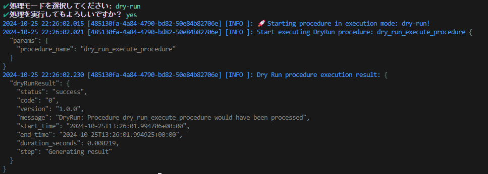

# ストアドプロシージャ実行 CLI アプリケーション

このアプリケーションは、CLI から指定したストアドプロシージャを実行するためのツールです。

`.env` ファイル内の環境変数に基づき、指定されたIDに対応するストアドプロシージャを実行します。  
実行には、確認プロンプトやライブランモードの設定などのオプションが利用できます。



## モチベーション

- Windows環境でローカルで実行するアプリVBAやpowershellがだが、エコシステムが充実しているNodeでローカルで実行できるアプリケーションを作成してみたかった。
- 対話形式で処理を進めるようなアプリのキャッチアップ
- Dry Runや誤作動を仕組みを実装ベースでキャッチアップしてみたかった。
- Exponential Backoff（指数関数的に増えるリトライ間隔）の実装

## 必要な環境
- Node.js 14 以上
- `.env` ファイルにて環境変数が設定されていること

## インストール
アプリケーションのディレクトリに移動し、依存関係をインストールします。
```bash
pnpm install
```

## 使用方法

次のコマンドでストアドプロシージャを実行します。

```sh
node index.js procedure -i <id> [options]
```

### オプション一覧

| オプション          | 説明                                                         |
|---------------------|------------------------------------------------------------|
| `-i, --id <id>`    | **必須** `.env` ファイル内で指定されたIDに対応する値を見つけるためのID。 |
| `-y, --yes`        | 確認プロンプトなしで即実行します。                           |
| `-r, --run`        | LiveRun モードで実行します。                                |


## 例

例1: ストアドプロシージャをDryRunモードで実行（確認プロンプトあり）

```sh
node index.js procedure -i YOUR_PROCEDURE_ID
```

例2: 確認プロンプトをスキップし、ストアドプロシージャをDryRunモードで実行

```sh
node index.js procedure -i YOUR_PROCEDURE_ID -y
```

例3: 確認プロンプトなしで、LiveRunモードで実行

```sh
node index.js procedure -i YOUR_PROCEDURE_ID -y -r
```

例4: コマンドのヘルプを表示します。


```sh
node index.js -h

Usage: cli [options] [command]

CLI アプリケーション

Options:
  -V, --version        output the version number
  -h, --help           display help for command

Commands:
  procedure [options]  idで指定されたストアドプロシージャーを実行する。
  help [command]       display help for command
```

例5: より詳細なヘルプを表示します。

```sh
node index.js procedure -h

Usage: cli procedure [options]

idで指定されたストアドプロシージャーを実行する。

Options:
  -i, --id <id>  .envファイル内で対応する値を見つけるためのID
  -y, --yes      確認プロンプトなしで即実行
  -r, --run      LiveRunモードで実行
  -h, --help     display help for command
```

## 設定ファイル

このCLIアプリケーションは、.env ファイルを使用して、ストアドプロシージャを識別するためのIDを管理します。

```
YOUR_PROCEDURE_ID=my_procedure
```

## エラーハンドリング

.env ファイルに指定されたIDが見つからない場合、エラーメッセージが表示されます。
実行時に何らかのエラーが発生した場合は、詳細なエラーメッセージと共に終了コードが返されます。